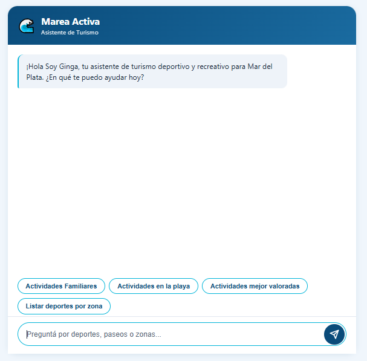
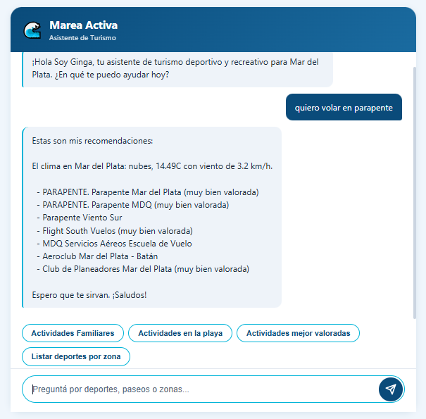
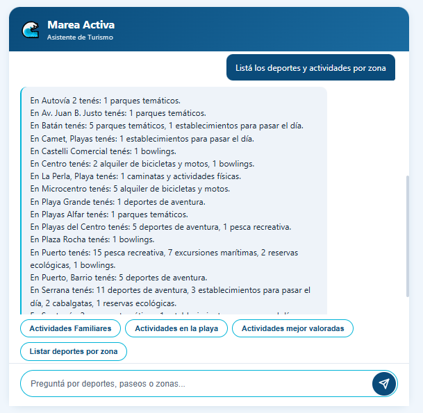
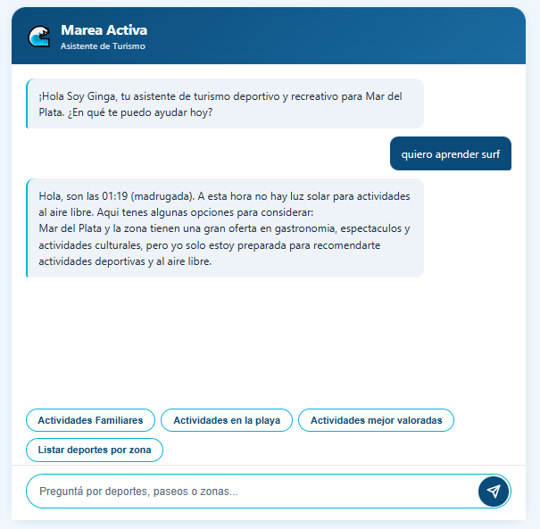
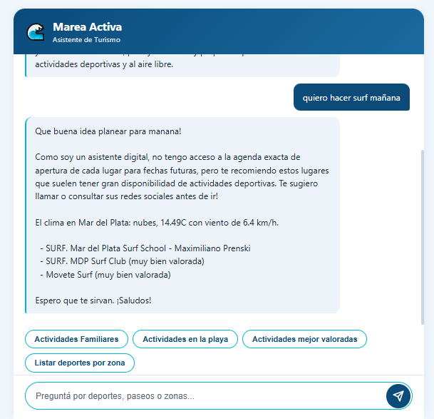
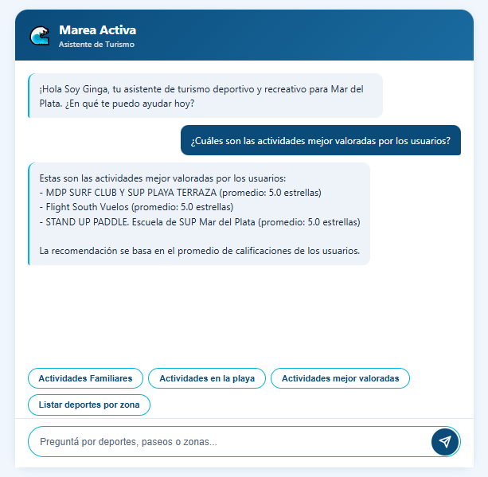
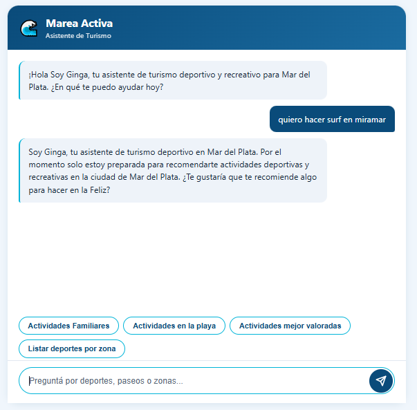

# Marea Activa: Asistente de Turismo Deportivo

**Marea Activa** es un chatbot inteligente diseñado para la ciudad de Mar del Plata, Argentina. Utiliza inteligencia artificial generativa (Gemini API) y procesamiento de datos local (Pandas) para recomendar actividades deportivas y recreativas al aire libre. El sistema considera factores climáticos en tiempo real, restricciones horarias y consultas con intención temporal futura, implementando una arquitectura basada en agentes con resolución de conflictos lógicos para ofrecer una experiencia conversacional fluida y contextualizada.

Desarrollo de un sistema de recomendación inteligente bajo arquitectura de agentes, con lógica personalizada de filtrado de datos y gestión de restricciones contextuales.

---

## Tecnologías

| Componente | Tecnología | Descripción |
|---|---|---|
| Backend | **FastAPI** (0.115.6) | Framework web asíncrono de alto rendimiento para la API REST. |
| Servidor | **Uvicorn** (0.34.0) | Servidor ASGI para desarrollo y producción. |
| Procesamiento de datos | **Pandas** (2.2.3) | Análisis y filtrado de datasets CSV de actividades turísticas. |
| Cliente HTTP | **Httpx** (0.28.1) | Cliente asíncrono para consumo de APIs externas (Gemini, clima). |
| IA Generativa | **Gemini API** (Google) | Modelo de lenguaje para generación de respuestas conversacionales. |
| Variables de entorno | **python-dotenv** (1.0.1) | Gestión de claves API y configuración sensible. |
| Testing | **Pytest** (8.3.4) | Framework de pruebas unitarias. |

---

###Pasos para la Instalación y Configuración
##1. Clonar el repositorio
```bash
git clone https://github.com/Sandramar-mdq/marea-activa-ia.git
cd marea-activa-ia
```

##2. Crear y activar el entorno virtual
Es necesario aislar las dependencias del proyecto. Ejecuta según tu sistema operativo:

En Windows (CMD / PowerShell):
```bash
python -m venv .venv
..venv\Scripts\activate
```
En Linux / macOS:
```bash
python3 -m venv .venv
source .venv/bin/activate
```
##3. Instalar dependencias
Con el entorno virtual activo, instala las librerías necesarias ejecutando:
```bash
pip install -r requirements.txt
```
##4. Configurar variables de entorno
Crea un archivo llamado .env en la raíz del proyecto y añade tu clave de API de Gemini:

GEMINI_API_KEY=tu_clave_aquí

Ejecución del Servidor
Opción Rápida (Solo Windows)
Si estás en Windows, podes iniciar el backend y abrir automáticamente la documentación interactiva en tu navegador haciendo doble clic sobre el archivo de automatización o ejecutando en la terminal:
```bash
iniciar_servidor.bat
```
Opción Manual (Cualquier Sistema Operativo)
Si prefieres levantar el proceso de forma manual o estás en Linux/macOS, asegúrate de tener el entorno activo y ejecuta:
```bash
python -m uvicorn src.main:app --reload --reload-dir src
```
El servidor estará disponible en http://localhost:8000. Puedes probar los endpoints directamente desde la interfaz interactiva de Swagger UI en http://localhost:8000/docs.

---

## Estructura del Proyecto

```
marea_activa/
├── src/
│   ├── main.py                # Punto de entrada de la aplicación FastAPI
│   ├── config.py              # Carga de variables de entorno
│   ├── models/
│   │   └── requests.py        # Modelos Pydantic (ChatRequest, ChatResponse, ActivityItem)
│   ├── routes/
│   │   └── chat.py            # Endpoint POST /api/chat
│   └── services/
│       ├── orchestrator.py    # Orquestador principal: detección de intención, filtros Pandas, recomendación
│       ├── ginga_agent.py     # Agente conversacional: prompt system, generación de respuestas con Gemini
│       ├── data_loader.py     # Carga y merge de datasets CSV
│       ├── classifier.py      # Clasificación de intensidad y edad
│       ├── sentiment.py       # Análisis de sentimiento basado en estrellas
│       └── weather.py         # Consumo de API de clima en tiempo real
├── static/
│   ├── index.html             # Interfaz web del chatbot
│   ├── css/                   # Estilos de la interfaz
│   └── js/                    # Lógica frontend (comunicación con la API)
├── datasets/
│   ├── recreacion_0.csv       # Dataset principal de actividades
│   └── opiniones_google.csv   # Opiniones y calificaciones de usuarios
├── tests/
│   └── test_weather_functions.py  # Pruebas unitarias
├── docs/
│   └── img/                   # Capturas de pantalla de la interfaz
├── requirements.txt
└── README.md
```

### Descripción de módulos clave

- **`src/services/orchestrator.py`**: Componente central del sistema. Detecta la intención del usuario (deporte, zona, familia, playa, temporalidad futura), aplica filtros compuestos sobre el DataFrame con `.query()`, gestiona restricciones horarias y coordina las advertencias climáticas.

- **`src/services/ginga_agent.py`**: Define la personalidad de **Ginga** (anfitriona marplatense), construye el prompt estructurado con reglas de prioridad (temporal > horaria > dominio) y genera la respuesta conversacional a través de la API de Gemini.

- **`src/services/data_loader.py`**: Encargado de cargar, limpiar y hacer merge de los datasets CSV, aplicando el filtro de tipo de actividad para excluir turismo no deportivo.

---

## Funcionalidades Clave

### Interfaz del Chatbot

La interfaz ofrece una experiencia limpia e intuitiva con botones de acceso rápido para las consultas más comunes.



### Búsqueda de Actividades

El usuario puede buscar por nombre de deporte, zona o categoría. El sistema aplica filtros compuestos (actividad AND zona) y presenta resultados contextualizados con intensidad, público objetivo y sentimiento.



### Listado de Deportes por Zona

Funcionalidad que permite al usuario conocer todas las actividades disponibles organizadas geográficamente por zona de la ciudad.



### Gestión de Restricciones Horarias

El sistema detecta automáticamente la hora actual y emite advertencias cuando el usuario consulta actividades al aire libre fuera del horario solar, ofreciendo alternativas pertinentes.



### Resolución de Consultas Temporales (Futuro)

Cuando el usuario consulta por una fecha futura ("mañana", "el fin de semana"), el sistema suprime la restricción horaria actual, limpia las palabras temporales del mensaje de búsqueda y genera una respuesta empática que comienza con el término temporal original utilizado por el usuario.



### Valoraciones de Usuarios

Integración con opiniones de Google para presentar las actividades mejor calificadas, promediando las estrellas de los usuarios y ordenando por relevancia.



### Restriccion Geografica

El sistema detecta cuando el usuario menciona una ciudad, playa o localidad que **no** es Mar del Plata (Necochea, Miramar, Villa Gesell, Tandil, etc.) y responde amablemente que por el momento solo esta preparado para recomendar actividades en la Feliz. La deteccion excluye falsos positivos: si el usuario dice "soy de Buenos Aires, que hay en Mar del Plata?", el sistema acepta porque detecta la mencion a MDP.



---

## Arquitectura Basada en Agentes

El sistema implementa una arquitectura conversacional basada en agentes con las siguientes capas:

1. **Detección de Intención** (`_detect_intent`): Analiza el mensaje del usuario para identificar deporte, zona, tipo de consulta (playa/familia/actividad) y temporalidad.

2. **Filtrado Compuesto** (`_filtrar_compuesto`): Aplica filtros AND sobre el dataset utilizando `.query()` de Pandas, combinando zona y actividad en una sola operación legible y eficiente.

3. **Resolución de Conflictos Lógicos**: El sistema gestiona prioridades entre reglas contradictorias:
   - **Temporalidad futura** suprime la **restricción horaria** (si el usuario consulta "mañana", no se aplica el filtro de noche).
   - **Dominio estricto**: consultas fuera del ámbito deportivo reciben una respuesta predeterminada sin invocar al modelo de lenguaje.

4. **Generación de Respuesta** (`generar_respuesta`): Construye un prompt estructurado con contexto completo (clima, advertencias, items, reglas de prioridad) y lo envía a Gemini para generar una respuesta empática y personalizada.

---

## Créditos

Proyecto desarrollado como **Trabajo Práctico Integrador** para las asignaturas:

- Desarrollo de Sistemas con Inteligencia Artificial
- Ciencia de Datos
- Técnicas de Procesamiento del Habla

**Autora:** Sandra L. Dominguez

**Institución:** SECZA

---

## Nota Técnica

Marea Activa fue diseñado bajo el principio de **costo cero y procesamiento local**. Todo el filtrado, clasificación y limpieza de datos se realiza en memoria con Pandas, sin depender de bases de datos externas ni servicios cloud de pago. La única dependencia externa es la API de Google Gemini para la generación del lenguaje conversacional, y la API de clima para advertencias en tiempo real.

El sistema está construido con una filosofía de **desarrollo fragmentado y modular**, donde cada componente del pipeline (detección de intención → filtrado de datos → generación de respuesta) es independiente, testeable y reemplazable.

---

## Documentacion

El archivo [`INFORME_DESARROLLO.md`](INFORME_DESARROLLO.md) contiene la bitácora técnica completa del proyecto: arquitectura, cronologia de desarrollo, problemas resueltos, decisiones de diseño, edge cases y métricas de código.
